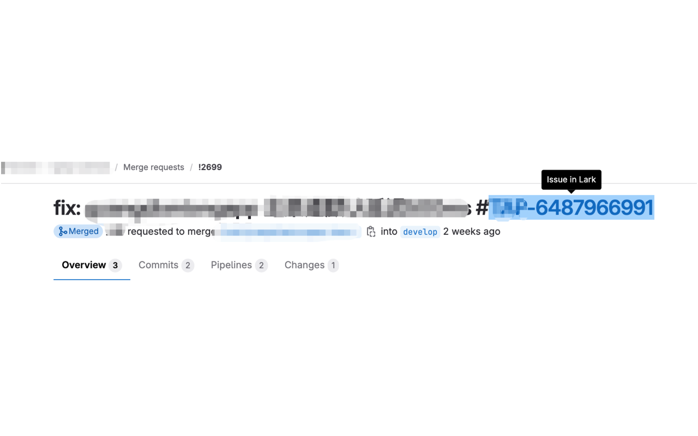
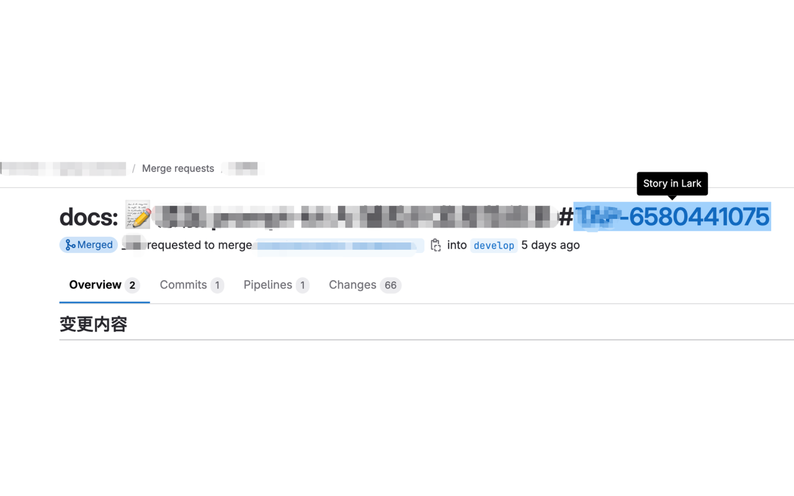

# Lark Project Linker

一个浏览器插件，连接 GitLab/GitHub/Sentry 与飞书项目。自动将项目 ID（如 `#XX-xxx`）转换为可点击的飞书链接，支持智能类型识别（Story/Issue）和一键创建飞书工单。让你的 DevOps 工作流更高效！

[飞书参考资料](https://bytedance.larkoffice.com/wiki/XusFwYp2ZiqltkkSTaJc7eMdnYb)

## ✨ 主要功能

### GitLab/GitHub 集成
- 🔗 **自动转换链接**：将 GitLab/GitHub 中的 `#XX-xxx`、`#M-xxx`、`#F-xxx` 等格式自动转换为飞书链接
- 🎯 **智能类型识别**：根据 commit 类型前缀自动判断是 Issue 还是 Story
  - `fix:`、`bugfix:`、`hotfix:` → Issue
  - `feat:`、`chore:`、`refactor:` → Story
- 💡 **自定义 Tooltip**：显示 "Issue in Lark" 或 "Story in Lark"，替代原生的 tooltip
- 🚀 **实时监听**：自动检测页面变化、标签切换、URL 变化
- ⚡ **性能优化**：防抖机制、智能缓存、避免重复处理
- 🔄 **类型统一**：确保同一 tid 的所有链接类型一致
- 🌐 **多平台支持**：同时支持 GitLab 和 GitHub

### Sentry 集成
- 🎫 **快速创建工单**：在 Sentry Issue 页面一键创建飞书 Issue
- 📝 **自动填充信息**：自动提取 Sentry Issue 标题、描述和 URL
- 🔗 **智能按钮定位**：自动在 Issue Tracking 区域添加"创建飞书 Issue"按钮

## 功能预览

### GitLab/GitHub 链接转换



## 安装

### 商店安装

[Chrome 应用商店](https://chromewebstore.google.com/detail/gitlab-link-to-lark/ocmkgfnifakgckfeofcoakiniljdjcfp)

### 本地开发安装

#### 1. 克隆项目

```bash
git clone https://github.com/wangbax/lark-project-linker.git
cd lark-project-linker
```

#### 2. 安装依赖

要求：Node.js >= 18

```bash
# 使用 yarn（推荐）
yarn install

# 或使用 npm
npm install
```

#### 3. 构建项目

```bash
# 使用 yarn
yarn build

# 或使用 npm
npm run build
```

构建完成后，产物会生成在 `dist` 目录中。

#### 4. 在浏览器中加载扩展

##### Chrome/Edge 浏览器

1. 打开浏览器，访问扩展管理页面：
   - Chrome: `chrome://extensions/`
   - Edge: `edge://extensions/`

2. 开启右上角的「开发者模式」


3. 点击「加载已解压的扩展程序」



4. 选择项目的 `dist` 文件夹，扩展安装成功！

## 配置

安装完成后，点击扩展图标或在扩展管理页面点击「选项」进行配置

### GitLab/GitHub 配置
- **飞书命名空间**：你的飞书项目空间名称，支持多个，用逗号分隔（如：`pojq34,app1,app2`）
  - 插件会自动尝试每个命名空间，直到找到有效的那个
- **域名地址**：用于匹配激活插件（如：`gitlab.com,github.com`），支持多个域名，用逗号分隔
- **项目 ID 前缀**：项目中使用的项目 ID 前缀，多个用逗号分隔（如：`XX,M,F,XX`）
  - 支持大小写，如 `XX` 可匹配 `#XX-6616715346`

### Sentry 配置（可选）
- **Sentry 域名地址**：你的 Sentry 域名（如：`sentry.com`），支持多个，用逗号分隔
- **Sentry Issue 创建地址**：后端 API 地址（如：`http://localhost:8080/api/feishu-sentry`）
  - 用于创建飞书工单、查询现有工单、获取字段选项

**注意**：
- `M-xxx` 会自动识别为 Story 类型
- `F-xxx` 会自动识别为 Issue 类型  
- 其他自定义前缀（如 `XX-xxx`）会根据上下文智能判断：
  - commit message 包含 `fix:`、`bugfix:`、`hotfix:` → Issue
  - commit message 包含 `feat:`、`chore:`、`refactor:` → Story
  - 后端会进一步验证并自动更正类型
- 多个飞书命名空间会按配置顺序依次尝试，并缓存有效的结果

## 使用场景

### GitLab/GitHub 使用

#### Merge Request/Pull Request 标题
```
fix: [AutoTest] Android 三方授权页面顶部无 title #XX-6581113659
                                              ↓
                                   自动识别为 Issue
```

#### Commit 列表
```
feat: 新增分享功能 #XX-123456789
                ↓
        自动识别为 Story
```

#### GitHub Commits 页面示例
```
feat: 修复 detekt 报错 # XX-6616715346
                     ↓
          点击项目 ID 跳转到飞书
          悬浮显示 Lark Tooltip
```

在 GitHub commits 页面（如 `https://github.com/XXXX/XXSDK-Monorepo/commits/branch-name/`）：
- 📍 commit 标题中的 `# XX-6616715346` 会被识别
- 🎯 点击项目 ID 部分直接跳转到飞书
- 💡 悬浮显示飞书项目信息
- 🔄 自动根据 commit 类型判断 Issue/Story

**配置示例：**
- 域名地址：`github.com`
- 项目 ID 前缀：`XX,XX,M,F`（根据实际项目配置）

#### 页面自动刷新
- ✅ 切换到 Commits 标签 → 自动扫描新链接
- ✅ 切换到 Changes 标签 → 自动扫描新链接
- ✅ 浏览器前进/后退 → 自动扫描新链接
- ✅ GitHub Turbo 导航 → 自动扫描新链接

### Sentry 使用

#### 快速创建飞书工单

1. 打开任意 Sentry Issue 页面
2. 在 Issue Tracking 区域找到"Feishu Issue"按钮
3. 点击"+"按钮打开创建工单弹窗
4. 弹窗会自动填充：
   - **标题**：Sentry 异常信息（带 `[Sentry]` 前缀）
   - **描述**：包含异常堆栈、环境、版本等信息
   - **报告人**：当前登录的 Sentry 用户（可搜索修改）
   - **经办人**：可搜索 Sentry 成员
   - **动态字段**：优先级、严重程度等（根据后端配置）
5. 填写完毕后点击"创建"
6. 创建成功后页面会自动显示工单号（如 `XX-6663198368`），点击可跳转

#### 查看已创建的工单

如果 Sentry Issue 已关联飞书工单：
- 按钮会显示工单号（如 `XX-6663148821`）
- 点击工单号直接跳转到飞书工单详情
- "+"按钮会被隐藏，避免重复创建

## 开发说明

### 目录结构

```
├── dist/               # 构建产物
├── src/
│   ├── js/            # JavaScript 源码
│   │   ├── index.js           # 主入口，核心通用功能
│   │   ├── gitlab-handler.js  # GitLab 平台处理器
│   │   ├── github-handler.js  # GitHub 平台处理器
│   │   ├── background.js      # 后台脚本
│   │   ├── sentry.js          # Sentry 内容脚本
│   │   ├── options.js         # 配置页面
│   │   ├── store.js           # 配置存储与缓存管理
│   │   ├── utils.js           # 工具函数
│   │   └── event.js           # 事件常量
│   ├── html/          # HTML 页面
│   └── assets/        # 静态资源
├── gulpfile.js        # 构建配置
└── package.json
```

### 开发模式

```bash
# 监听文件变化并自动构建
npm run watch
```

修改代码后，需要在浏览器扩展管理页面点击「重新加载」按钮。

### 代码架构

项目采用模块化架构，平台特定逻辑独立管理：

```
┌─────────────────────────────────────────────┐
│              index.js (主入口)               │
│  - 初始化配置和缓存                          │
│  - 提供核心功能（Popover、链接生成等）      │
│  - 监听通用事件                              │
│  - 初始化平台处理器                          │
└────────────┬────────────────────────────────┘
             │ 使用
             ↓
┌────────────────────────┐
│     store.js           │
│  - 配置管理            │
│  - 缓存管理            │
└────────────────────────┘

             │ 创建处理器
     ┌───────┴────────┐
     ↓                ↓
┌──────────────┐  ┌──────────────┐
│gitlab-handler│  │github-handler│
│   GitLab     │  │   GitHub     │
│   平台处理   │  │   平台处理   │
└──────────────┘  └──────────────┘
```

### 添加新平台支持

添加新平台只需3步：

#### 1. 创建处理器文件
```javascript
// src/js/bitbucket-handler.js
export function createBitbucketHandler(context) {
  function init() {
    // 初始化逻辑
  }
  
  return { init };
}
```

#### 2. 导入处理器
```javascript
// src/js/index.js
import { createBitbucketHandler } from "./bitbucket-handler";
```

#### 3. 初始化处理器
```javascript
// src/js/index.js
const isBitbucket = window.location.host.includes('bitbucket');

if (isBitbucket) {
  platformHandler = createBitbucketHandler(context);
  platformHandler.init();
}
```

### 调试技巧

#### 查看缓存
```javascript
// 在浏览器控制台中
chrome.storage.local.get('LARK_PROJECT_TYPE_CACHE', (result) => {
  console.log(result);
});
```

#### 清除缓存
```javascript
// 在浏览器控制台中
chrome.storage.local.remove('LARK_PROJECT_TYPE_CACHE');
```

## 更新日志

### v2.3.1 (2026-04-14)

**Bug 修复：**
- 🐛 适配 GitHub 新版 commit history 列表 DOM 结构，恢复提交标题中的飞书项目链接替换
- 🐛 避免在替换 `#TAP-...` 时误污染 commit 链接的 `title` 等属性，防止标题节点 HTML 被破坏

**兼容性优化：**
- 🔧 调整 GitHub 标题扫描逻辑，跳过 commit row 容器，避免被误识别为 PR/Issue 标题
- 🔧 非链接标题改为基于文本节点替换项目 ID，降低后续 GitHub UI 变更带来的脆弱性

### v2.3.0 (2026-01-14)

**新增功能：**
- ✨ **GitHub 完整支持**：新增对 GitHub 平台的完整支持
  - 支持 GitHub Commits 页面（如 `github.com/user/repo/commits/branch/`）
  - 智能识别 commit 标题中的项目 ID（如 `# XX-6616715346`）
  - 点击项目 ID 部分直接跳转到飞书（无需嵌套链接）
  - 支持 GitHub Pull Request 标题和评论
  - 支持 GitHub Turbo/PJAX 导航自动刷新
  - 自动识别 GitHub issue-link 和 hovercard 链接
- 🌐 **多平台统一体验**：GitLab 和 GitHub 使用相同的智能类型识别和 Tooltip

**代码重构：**
- ♻️ **模块化架构**：将代码拆分为独立的平台处理器
  - `gitlab-handler.js` - GitLab 平台特定处理
  - `github-handler.js` - GitHub 平台特定处理
  - `index.js` - 核心通用功能
  - `store.js` - 配置存储与缓存管理
- 📚 **架构优化**：
  - 平台逻辑完全独立，互不影响
  - 通过上下文对象共享状态和功能
  - 添加新平台只需 3 步
  - 整合 7 个文档文件为统一的 README.md
- 🎯 **代码质量提升**：
  - 清理所有 console.log 调试日志
  - 统一函数命名规范
  - 完善代码注释
  - 移除所有内联脚本，符合 CSP 规范

**Bug 修复：**
- 🐛 修复 GitLab MR 列表页标题不生效问题
- 🐛 修复飞书链接拼接错误
- 🐛 修复 GitHub Issue 详情页标题不生效
- 🐛 修复 GitHub Issue 描述和评论不可点击

**UI 优化：**
- 🎨 **配置页面优化**：
  - Sentry 配置改为"其他配置"并默认折叠
  - 添加展开/折叠动画效果
  - 优化配置项布局，突出核心配置
- 🎨 **交互优化**：
  - GitHub commit 标题中的项目 ID 显示虚线下划线
  - 悬浮显示飞书项目信息 Tooltip
  - 点击项目 ID 阻止原 commit 链接跳转，直接打开飞书

### v2.2.0 (2025-01-08)

**新增功能：**
- ✨ **Sentry 工单完整功能**：
  - 支持创建飞书工单（带模态框表单）
  - 自动填充报告人和经办人（支持搜索 Sentry 成员）
  - 支持动态字段配置（优先级、严重程度等）
  - 工单描述自动转换为飞书富文本格式（doc_text、doc、doc_html）
  - 支持查询已存在的工单并直接跳转
  - 创建成功后自动更新页面显示工单号
- 🎨 **配置页面优化**：配置项按功能分组（跳转配置 / Sentry 配置）

**体验优化：**
- 💡 轻量级 Toast 通知替代弹窗提示
- 💡 工单创建模态框 UI 优化，支持暗色模式
- 💡 自动提取异常信息和堆栈（前 20 帧）
- 💡 自动设置当前用户为默认报告人

### v2.1.0 (2025-01-06)

**新增功能：**
- ✨ **Sentry 集成**：支持在 Sentry Issue 页面一键创建飞书 Issue
- ✨ 自动提取 Sentry Issue 信息并预填充到飞书
- ✨ 支持多个 Sentry 域名配置
- ✨ 自定义 Tooltip：显示 "Issue in Lark" / "Story in Lark"
- ✨ 智能类型识别：根据 commit 类型前缀自动判断 Issue/Story
- ✨ 实时监听：支持页面变化、标签切换、URL 变化自动检测
- 🎨 Tooltip 样式优化：居中对齐、向下箭头、与 GitLab 原生样式一致

**性能优化：**
- ⚡ 使用 WeakSet 追踪 DOM 元素，避免重复处理
- ⚡ 防抖机制，减少不必要的扫描
- ⚡ 类型映射缓存，确保同一 tid 类型一致
- ⚡ 智能上下文分析，提高类型判断准确性

**问题修复：**
- 🐛 修复同一 tid 多个链接类型不一致的问题
- 🐛 屏蔽 GitLab 原生的 "Issue in Jira" tooltip
- 🐛 修复 commit 列表中链接无法正确识别的问题

## 贡献指南

1. Fork 项目
2. 创建功能分支 (`git checkout -b feature/AmazingFeature`)
3. 提交更改 (`git commit -m 'Add some AmazingFeature'`)
4. 推送到分支 (`git push origin feature/AmazingFeature`)
5. 开启 Pull Request

## 许可证

MIT License
